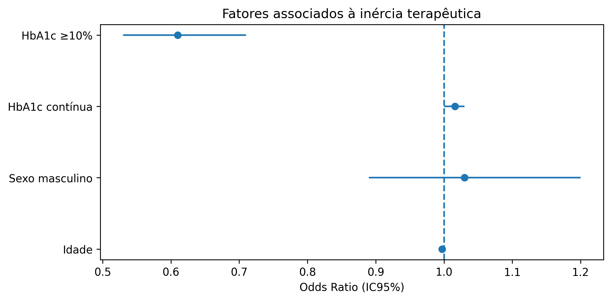
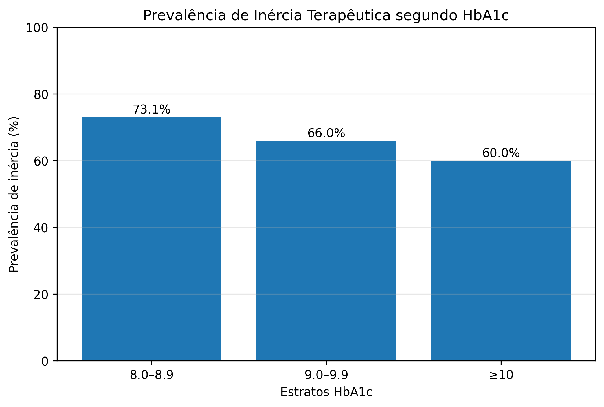
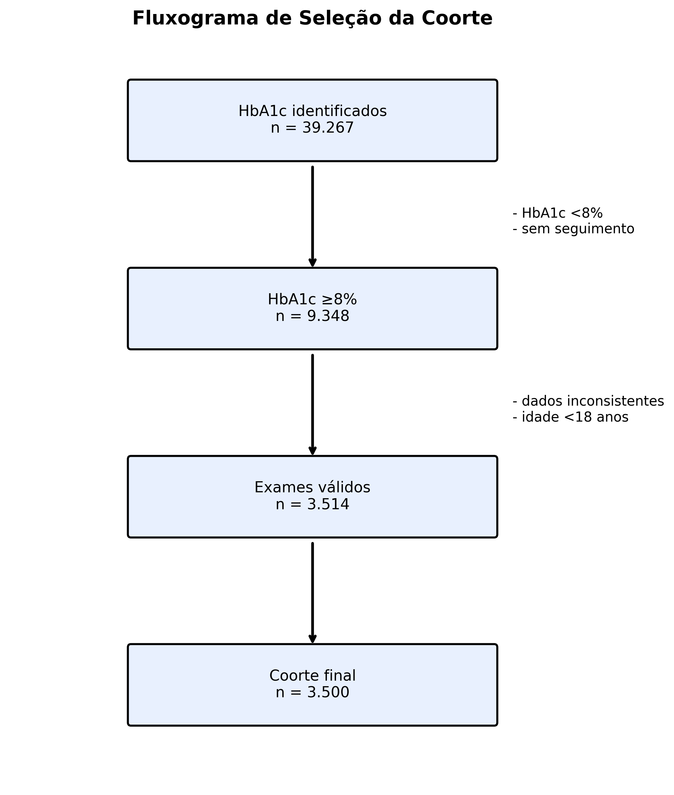

# Vigilância Clínica DM2 - APS

Pipeline analítica longitudinal para identificação de inércia terapêutica em pacientes com Diabetes Mellitus tipo 2 (DM2) na Atenção Primária à Saúde utilizando dados do e-SUS APS.

---

# Objetivo

Desenvolver uma pipeline reprodutível para:

- identificar pacientes com DM2 descompensado;
- detectar inércia terapêutica após HbA1c elevada;
- construir coorte longitudinal;
- gerar indicadores epidemiológicos;
- produzir análises estatísticas automatizadas;
- disponibilizar dashboard clínico interativo.

---

# Definição de Inércia Terapêutica

Foi considerada inércia terapêutica quando:

- paciente apresentou HbA1c ≥ 8%;
- houve prescrição antes e após o exame;
- não ocorreu intensificação terapêutica em até 180 dias após HbA1c alterada.

---

# Principais Resultados

| Indicador | Resultado |
|---|---|
| Pacientes incluídos | 3.500 |
| HbA1c média | 9,9% |
| HbA1c ≥10% | 41,4% |
| Prevalência de inércia terapêutica | 66,4% |
| Intensificação terapêutica | 33,6% |
| Sexo feminino | 67,1% |
| Idade média | 62,7 anos |

---

# Regressão Logística

Modelo multivariado para fatores associados à intensificação terapêutica.

## Variáveis avaliadas

- idade;
- sexo;
- HbA1c.

## Resultado principal

Maior HbA1c associou-se à menor chance de inércia terapêutica.

OR ajustado HbA1c:

- OR = 0,84
- IC95%: 0,81–0,88
- p < 0,001

---

# Estrutura do Projeto

text
TCC_DM2_INERCIA/
│
├── core/
│   └── database.py
│
├── dashboard/
│   ├── app.py
│   └── pages/
│       └── 02_pacientes_prioritarios.py
│
├── scripts/
│   ├── etl/
│   │   └── 01_extracao_esus.py
│   │
│   ├── analytics/
│   │   ├── 02_coorte_dm2.py
│   │   ├── 03_coorte_longitudinal.py
│   │   ├── 04_motor_inercia.py
│   │   └── 05_enriquecimento_coorte.py
│   │
│   └── analysis/
│       ├── 20_regressao_logistica.py
│       ├── 21_forest_plot_publicacao.py
│       ├── 30_serie_temporal.py
│       ├── 31_tabela1.py
│       ├── 32_inercia_por_hba1c.py
│       └── 33_fluxograma_coorte.py
│
├── docs/
│   └── figuras/
│
├── data/
│   └── results/
│
├── README.md
├── requirements.txt
└── .gitignore

# Pipeline Analítica

1. Extração ETL

# Script:

01_extracao_esus.py

# Função:

extração de exames laboratoriais;
extração de prescrições;
preparação inicial das tabelas.
2. Construção da Coorte

# Scripts:

02_coorte_dm2.py
03_coorte_longitudinal.py

# Função:

identificação dos pacientes DM2;
organização longitudinal dos exames;
seleção de HbA1c alteradas.
3. Motor de Inércia Terapêutica

# Script:

04_motor_inercia.py

# Função:

detectar intensificação terapêutica;
calcular inércia terapêutica;
gerar coorte final analítica.
4. Enriquecimento Clínico

# Script:

05_enriquecimento_coorte.py

# Função:

adicionar sexo;
adicionar idade;
enriquecer coorte para análises estatísticas.
5. Análises Estatísticas

# Scripts:

20_regressao_logistica.py
21_forest_plot_publicacao.py
30_serie_temporal.py
31_tabela1.py
32_inercia_por_hba1c.py
33_fluxograma_coorte.py

# Função:

regressão logística;
tabelas descritivas;
gráficos epidemiológicos;
forest plot;
fluxograma da coorte.
Dashboard Interativo

# Aplicação desenvolvida com Streamlit.

Funcionalidades
pacientes prioritários;
filtros clínicos;
distribuição HbA1c;
métricas automáticas;
classificação de risco;
exportação da lista prioritária.
Executar dashboard
streamlit run dashboard/app.py
# Figuras

## Forest Plot

---

## Inércia Terapêutica segundo HbA1c

---

## Fluxograma da Coorte

# Reprodutibilidade
Instalação

Criar ambiente virtual:

python -m venv .venv

Ativar ambiente:

.venv\Scripts\activate

Instalar dependências:

pip install -r requirements.txt

# Execução Sequencial

    ETL
python -m scripts.etl.01_extracao_esus
    Coorte
python -m scripts.analytics.02_coorte_dm2
python -m scripts.analytics.03_coorte_longitudinal
    Inércia Terapêutica
python -m scripts.analytics.04_motor_inercia
    Enriquecimento
python -m scripts.analytics.05_enriquecimento_coorte

#  Análises Estatísticas

python -m scripts.analysis.20_regressao_logistica
python -m scripts.analysis.21_forest_plot_publicacao
python -m scripts.analysis.30_serie_temporal
python -m scripts.analysis.31_tabela1
python -m scripts.analysis.32_inercia_por_hba1c
python -m scripts.analysis.33_fluxograma_coorte

# Tecnologias Utilizadas

Python
Pandas
NumPy
Statsmodels
Scikit-learn
Matplotlib
Seaborn
Plotly
Streamlit
PostgreSQL
Git/GitHub

# Aspectos Éticos

Este projeto utiliza dados secundários oriundos do e-SUS APS.

Os dados utilizados foram anonimizados e agregados, sem identificação individual dos pacientes, respeitando princípios éticos e de confidencialidade em pesquisa em saúde.

# Licença

MIT License

# Autora

Amanda Menezes dos Santos

Graduanda em Farmácia — UFBA
Técnica Ambiental — IFBA

# Contato

GitHub:

https://github.com/amandamenezes2-a11y/tcc-dm2-inercia-aps

# Dashboard pública
Acesse a versão demonstrativa:
https://tcc-dm2-inercia-aps-szv8w2yvtxcwqitq5s92vn.streamlit.app/